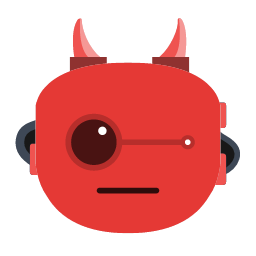
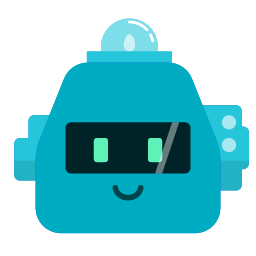
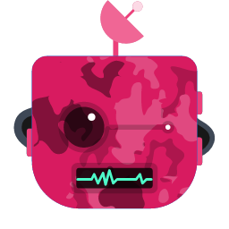
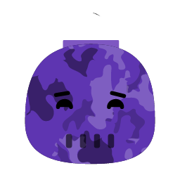

# Funky Bots - Bitcoin Cash SmartBCH Non-Fungible Tokens

## Get Funky!

Name: FunkyBots

Symbol: FunkyBots

Contract address: 0xad2f872AF013C7275eEBC6e7a43d604bA186db6D

Total supply: 250

NFT images and metadata are stored on [IPFS](https://gateway.pinata.cloud/ipfs/QmXnLCbANTCeCkkkNdx6Cpvjg4r9MiXFqpTvqKJape2AYP/)


Sample images

  

  

  

Each one is unique and has a [nickname](https://github.com/mazetoken/funkybots/blob/main/FunkyBotsNicknames.txt)


## Wallet

Use MetaMask mobile app to see NFT images

Add SmartBCH network (RPC)

```
Network name: SmartBCH
RPC URL: https://smartbch.greyh.at
or
https://smartbch.fountainhead.cash/mainnet
or
https://global.uat.cash
Chain ID: 10000
Currency Symbol: BCH
```

Add the token as usual - „+ Add tokens”, paste FunkyBots NFT contract address (0xad2f872AF013C7275eEBC6e7a43d604bA186db6D), but type manually token symbol (FunkyBots) and set decimals (tokens of precision) 0

Go to NFTs tab and tap „+ Add NFTs”, then paste contract address again and type your NFT ID. You might need to tap „Add” twice


## Trade on Oasis NFT Marketplace

FunkyBots [Collection](https://oasis.cash/collection/0xad2f872AF013C7275eEBC6e7a43d604bA186db6D)

_It may take a few minutes for images to load from IPFS. Refresh the page._


-------------------------------------------------------------
[Telegram](https://t.me/mazetokens)

[FunkyBots on Github](https://github.com/mazetoken/funkybots)
